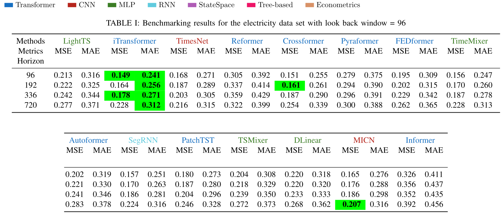
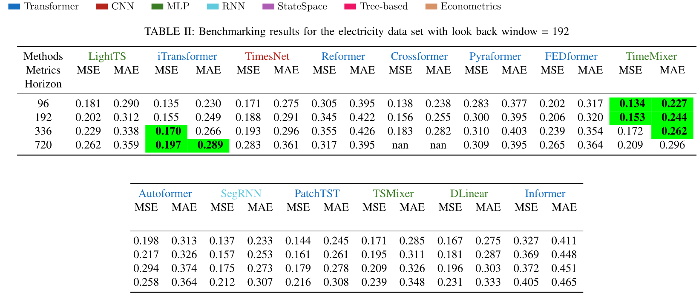

# Deep Learning for electric load forecasting

This repo presents the results of numerous methods for electric load forecasting. 

---

## Data sets
We use the following three data sets for electric load forecasting (see this [repo](https://github.com/teimour-halizadeh/datasets_forcasting) for more details): 
1. UCI Electricity Load Diagrams 
2. SmartMeter Energy Consumption Data in London Households
3. Residential Data from Pecan Street

---

## Methods

The main body of the models are from [TSLIB](https://github.com/thuml/Time-Series-Library).

---

## Results

The best result is highlighted:

---

